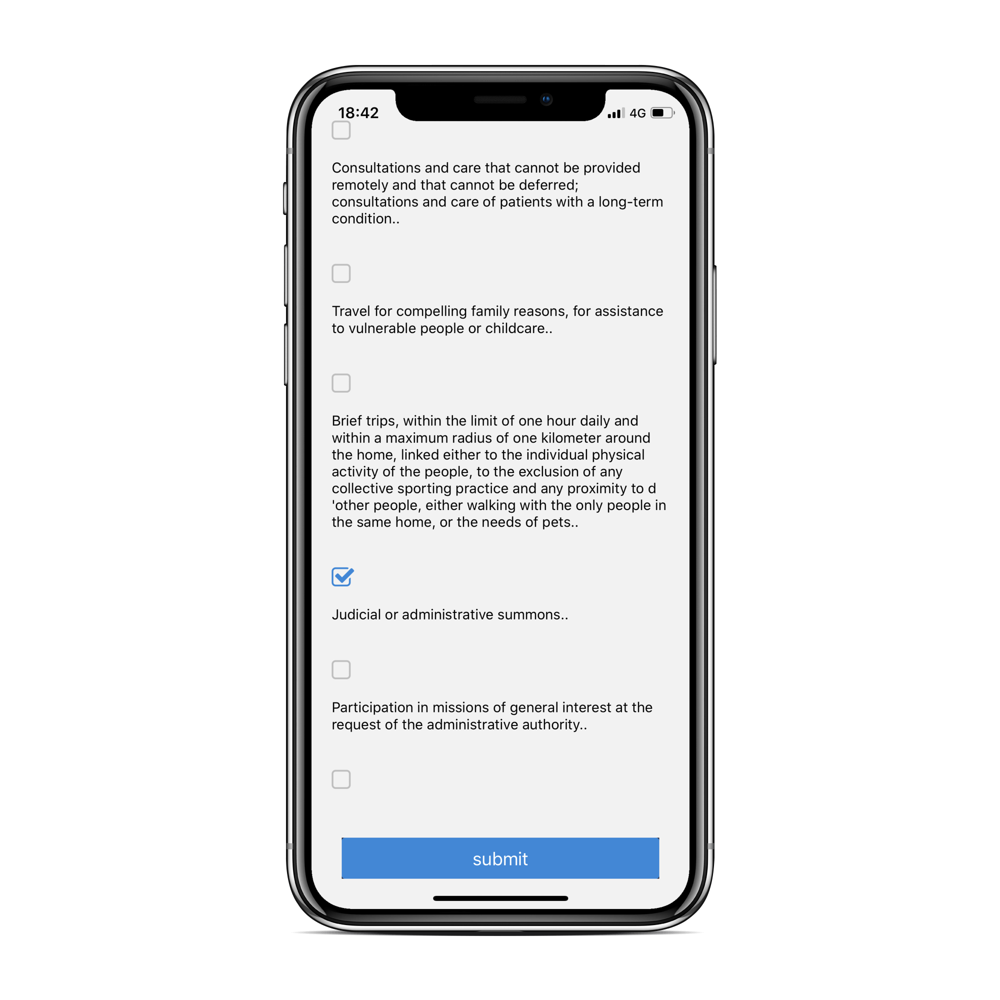
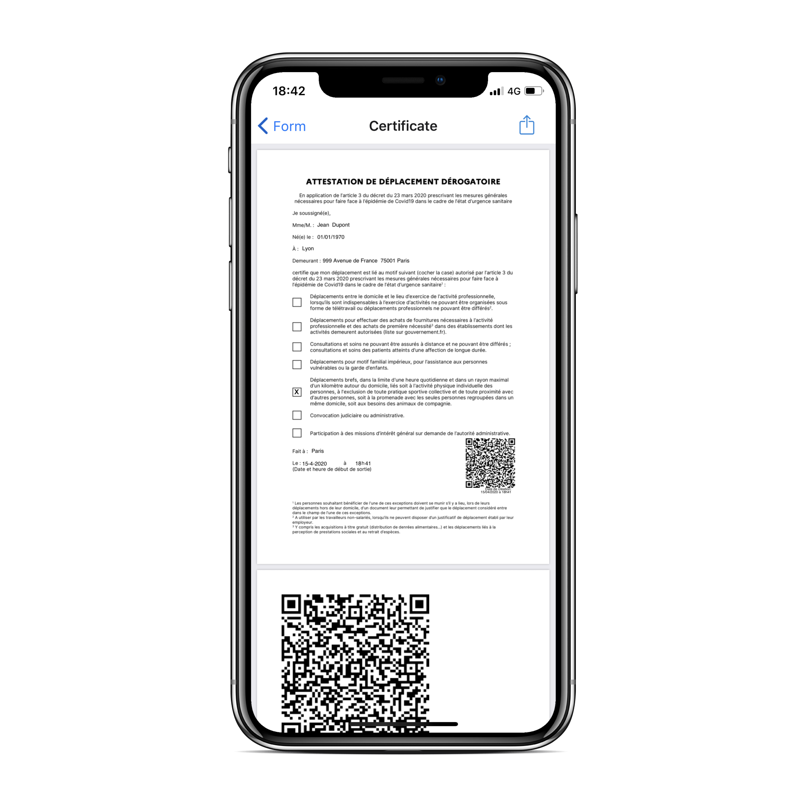

# COVID-19 French Attestation Deplacement generator
This is React Native based mobile application implemented based on the official [GÉNÉRATEUR D'ATTESTATION DE DÉPLACEMENT DÉROGATOIRE ](https://media.interieur.gouv.fr/deplacement-deplacement-covid-19-19/)

It generates the same PDF document with QR code embeded as the official generator.
It does not persist your data or send it anywhere, nor any other inforation is gathered.

It support localization, it uses English translation on any device with non French language set.
The certificate still be generated in French since it is official document. Certificate can be saved or shared using standard OS sharing feature.
For better usability during the application session it holds in memory the filled personal form details, but once the application is closed or removed the data is lost.

Credits:

Web version from government : https://media.interieur.gouv.fr/deplacement-covid-19/  
Codebase from government : https://github.com/LAB-MI/deplacement-covid-19

### Setup project

1. Install Node.js
2. `npm install expo-cli --global`
3. Create account in [expo.io](expo.io)
4. Install [yarn](https://classic.yarnpkg.com/en/docs/install) 

### Run project in developer mode

#### Using OS Simulators (XCode, Android Studio)
Run `yarn ios` or `yarn android`

#### Using Expo apllication
Download 'Expo' app and log in
Run `expo start` and scan the appeared QR code

### Generate production build

1. Run in project folder `expo build:android` or `expo build:ios`
2. Log in your account in terminal

More info [here](https://docs.expo.io/versions/latest/distribution/building-standalone-apps/)

### Screenshots

#### iOS english version

### Contribution

Feel free to submit an issue or open a pull request